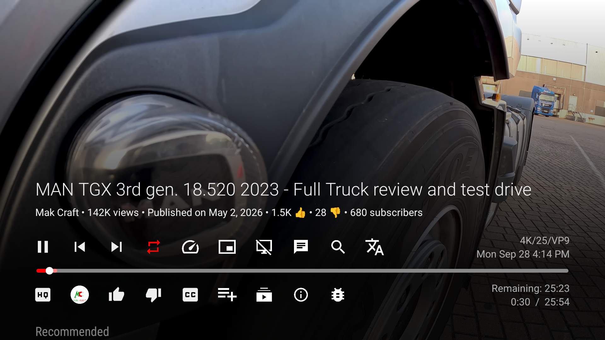

# SmartTube VOX

**Unofficial SmartTube fork focused on improved voice-over translation for Android TV and Google TV.**

**Неофициальная версия SmartTube с улучшенным закадровым переводом для Android TV и Google TV.**

[Download / Скачать](https://github.com/Kiryuhak/SmartTube-Vox/releases) · [What's new / Что нового](CHANGELOG.md) · [Credits / Благодарности](CREDITS.md)

## Features

- Yandex voice-over translation with a standard voice or **Lively Voice** («Живой голос»).
- Prepares translation for videos without a ready voice-over and waits for it automatically.
- Keeps translated audio aligned with pause, resume, seeking, and playback speed.
- Cleans up translation when switching videos and restores the original audio when translation stops.
- Lets you mix the original sound with translated speech.
- Falls back to the previous stable translation path if the newer path fails before playback.
- TV-friendly controls with a **Translation / Перевод** button, time display choices, and in-app update support.

## Download and install

1. Download an APK from [GitHub Releases](https://github.com/Kiryuhak/SmartTube-Vox/releases).
2. Choose `armeabi-v7a` for many older or 32-bit Android TV devices, `arm64-v8a` for a 64-bit device, or `universal` if you are unsure (it is larger). The `x86` build is mainly for emulators.
3. Allow APK installation on your TV or box, then open the downloaded file.

Current build: **32.56-vot.3** · Android package: `io.github.kiryuhak.smarttubevot.stable` · versionCode: `2446003`.

SmartTube VOX installs alongside the original SmartTube. If you already use an older SmartTube VOT build with the same package ID and signing key, install the new APK as an update.

## Lively Voice / «Живой голос»

Standard Yandex translation can work without a Yandex ID. For Lively Voice, sign in to SmartTube and Yandex ID. Where supported, activation happens automatically. You can also open **Settings → Player → Voice translation (Yandex) → Sign in with Yandex**.

Обычный перевод Яндекса может работать без Яндекс ID. Для «Живого голоса» войдите в SmartTube и Яндекс ID. Если автоматическое включение недоступно, откройте **Настройки → Плеер → Закадровый перевод (Яндекс) → Войти в Яндекс**.

## Русский

**Что умеет SmartTube VOX:** переводит видео голосом Яндекса, предлагает обычную озвучку и «Живой голос», а при отсутствии готового перевода запускает его подготовку и ожидает результат. Перевод следует за паузой, перемоткой и изменением скорости. При переключении ролика или отключении перевода обычный звук восстанавливается. Можно настроить баланс оригинального звука и озвучки.

В плеере есть кнопка **«Перевод»**. Интерфейс приспособлен для телевизора и пульта; доступны варианты отображения времени и проверка обновлений в приложении.

**Установка:** скачайте APK на странице [Releases](https://github.com/Kiryuhak/SmartTube-Vox/releases). Для многих старых или 32-битных устройств подойдёт `armeabi-v7a`, для 64-битных — `arm64-v8a`. Если не знаете архитектуру, выберите более крупный `universal`. Сборка `x86` предназначена главным образом для эмуляторов.

## Project and license / О проекте и лицензии

SmartTube VOX is an independent, unofficial fork of [SmartTube](https://github.com/yuliskov/SmartTube). It is not affiliated with SmartTube, Yandex, or Google. Source code is distributed under [GPLv3](LICENSE), with third-party attribution in [CREDITS.md](CREDITS.md) and [NOTICE](NOTICE).

SmartTube VOX — независимый неофициальный форк SmartTube. Проект не связан с авторами SmartTube, Яндексом или Google. Исходный код распространяется по GPLv3; сведения об использованных проектах и обязательные уведомления приведены в файлах выше.

Found a problem? / Нашли ошибку? [Open an issue / Создать обращение](https://github.com/Kiryuhak/SmartTube-Vox/issues).

Developer build instructions / Инструкции по сборке: [docs/BUILDING.md](docs/BUILDING.md).
