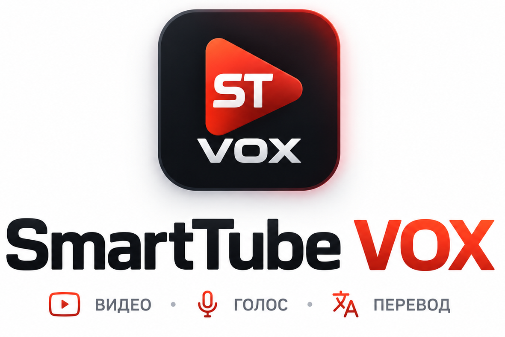

  

  <strong>Независимая неофициальная версия SmartTube для телевизоров с расширенным закадровым переводом Яндекса и автоматическим подбором совместимых видео- и аудиоформатов.</strong>

  <a href="https://github.com/Kiryuhak/SmartTube-Vox/releases/latest"><strong>Скачать</strong></a> ·
  <a href="https://github.com/Kiryuhak/SmartTube-Vox/releases/latest">Последний релиз</a> ·
  <a href="CHANGELOG.md">История изменений</a> ·
  <a href="https://github.com/Kiryuhak/SmartTube-Vox/issues">Сообщить об ошибке</a> ·
  <a href="docs/BUILDING.md">Инструкция по сборке</a>

  
  
  
  
  

## 📺 О проекте SmartTube VOX

SmartTube VOX сохраняет удобный телевизионный интерфейс [SmartTube](https://github.com/yuliskov/SmartTube) и добавляет технологии нейросетевого закадрового перевода Яндекса, встроенный менеджер загрузок, автоматический выбор видео- и аудиокодеков под возможности телевизора и инструменты диагностики совместимости.

У приложения собственный пакет и независимый канал обновлений: его можно установить рядом с оригинальным SmartTube. Проект развивается сообществом независимо и не является официальной версией SmartTube, Яндекса или Google.

---

## 🚀 Что нового в VOX 7

Поколение **VOX 7** объединяет ключевые улучшения стабильности, совместимости и удобства просмотра:

- **Единая продуктовая архитектура**: Общая модель возможностей устройств (`vox-device-profile-v1`) и фундамент кроссплатформенной поддержки Android TV / Google TV и Samsung Tizen.
- **Автоматическая настройка устройства**: Интеллектуальный автотюнер на основе реальных аппаратных сигналов (RAM, ядер CPU, экрана, аппаратных декодеров `MediaCodec`) с рекомендательным диалогом и быстрым применением.
- **Оценка рисков несовместимости**: Предупреждающий диалог при ручном выборе неподдерживаемых устройством форматов с возможностью отката к рекомендованным настройкам.
- **Интеллектуальный выбор кодеков**: Автоматический подбор оптимального видеопотока (AV1, VP9, AVC) и аудиодорожки (EAC3, AC3, Opus, AAC) под процессор и аудиосистему ТВ.
- **Режимы совместимости**: Возможность выбрать автоматический режим, режим максимального качества или максимальной совместимости для старых ТВ-приставок.
- **Безопасная диагностика и журнал ошибок**: Структурированное изолированное логирование с кольцевым буфером, строгой санитизацией токенов/IP/персональных данных, просмотром журнала в настройках и безопасной отправкой отчёта разработчикам только по прямому согласию пользователя.
- **Диагностика устройства**: Наглядный отчёт об аппаратных характеристиках экрана, видео- и аудиодекодеров с гарантированной защитой конфиденциальных данных.
- **Полноценный раздел «Скачанные видео»**: Постоянный доступ к сохранённым материалам в боковом меню, поддержка офлайн-воспроизведения и контроль свободного места.
- **Индикация прогресса и байтов в реальном времени**: Отображение точного прогресса загрузки с объёмом в человекочитаемом виде (`245 МБ / 1,0 ГБ · 24%`) на карточках видео и компактного процента на панели плеера (HUD).
- **Плавный бегущий текст в меню**: Спокойная бегущая строка (Marquee) длинных заголовков бокового меню только при активном фокусе с задержкой старта и возвратом к началу при смене позиции.
- **Премиальные индикаторы качества**: Аккуратные капсульные бейджи `4K · 2160p`, `2K · 1440p`, `FHD · 1080p`, `HD · 720p`, `SD · 480p` в едином TV-стиле без дублирования.
- **Повышенная надёжность перевода**: Автоматическое определение языка речи, русскоязычные подсказки при ошибках и надежное сохранение авторизации Яндекс ID.
- **Режимы чата трансляций**: Возможность переключения между интересными и всеми сообщениями в прямом эфире.

---

## 📱 Поддерживаемые платформы

| Платформа | Статус | Примечание |
|---|---|---|
| **Android TV / Google TV** | Поддерживается | Нативный APK, аппаратное ускорение MediaCodec, ExoPlayer, Leanback UI. |
| **Samsung Tizen** | В разработке / Preview | Архитектурная основа и сборка WGT реализованы; подробнее в [Матрице совместимости Tizen](docs/TIZEN_COMPATIBILITY_MATRIX.md); этап физического тестирования на ТВ впереди. |

---

## 📺 Android TV / Google TV

Нативная версия SmartTube VOX для телевизоров и медиаприставок под управлением Android TV и Google TV:

- **Основа**: Оптимизированный медиадвижок ExoPlayer с кастомным селектором дорожек, адаптивной политикой буферизации (подробнее в [Архитектуре медиа-стека и совместимости](docs/MEDIA3_COMPATIBILITY.md)) и полной поддержкой навигации пультом (D-Pad).
- **Аппаратное сканирование**: Определение возможностей чипсета через `MediaCodecList` и `AudioTrack` без лишней нагрузки на интерфейс.
- **Безопасный откат (Fallback)**: Если формат не поддерживается устройством, плеер автоматически переключается на доступный рабочий поток без сбоев и зависаний.
- **Селективный прокси**: Изолированная маршрутизация запросов перевода через встроенный прокси при сохранении прямого скоростного соединения с видеосервером.

---

## 🎞 Совместимость видео и аудио

SmartTube VOX проверяет возможности вашего устройства и автоматически выбирает тот формат, который телевизор способен плавно воспроизвести.

### Видеокодеки:
- **AV1**: Современный эффективный кодек. Выбирается, если поддерживается телевизором аппаратно.
- **VP9**: Высокое качество и поддержка разрешений до 4K на большинстве современных ТВ.
- **AVC / H.264**: Классический стандарт с максимальной совместимостью даже на старых чипсетах.
- **HEVC / H.265**: Поддерживается аппаратным сканером возможностей.

> **Пример**: Если телевизор или приставка не поддерживают аппаратное декодирование AV1, SmartTube VOX автоматически выберет поток VP9 или AVC.

### Аудиокодеки:
- **EAC3 (Dolby Digital Plus / 5.1)**: Многоканальный звук высокой чёткости.
- **AC3 (Dolby Digital / 5.1)**: Проверенный формат объемного звука.
- **Opus / AAC**: Высококачественное стерео с гарантированным воспроизведением на любых устройствах.

> **Passthrough**: Если телевизор не декодирует объемный звук EAC3 самостоятельно, но подключён к саундбару или AV-ресиверу через HDMI ARC/eARC, приложение задействует сквозную передачу звука (Passthrough).

---

## ⚙️ Режимы совместимости и автонастройка

В меню **Настройки → Совместимость устройства** доступны:

- **Автоматическая настройка**: Сканирует платформенные параметры устройства (объем оперативной памяти, ядра CPU, разрешение экрана и аппаратные декодеры `MediaCodec`) и предлагает оптимальный профиль с пояснениями и кнопкой быстрого применения.
- **Оценка рисков несовместимости**: При ручном выборе формата или разрешения, превышающих аппаратные возможности телевизора, приложение отобразит информативный диалог с описанием возможных сбоев и вариантами «Продолжить» или «Вернуть рекомендуемые настройки».
- **4 режима работы**:
  1. **Автоматически (рекомендуется)**: Баланс между качеством и возможностями устройства.
  2. **Максимальное качество**: Приоритет наилучшего разрешения и многоканального звука среди подтверждённых форматов.
  3. **Максимальная совместимость**: Принудительный выбор AVC и AAC для исключения подтормаживаний на слабых или устаревших приставках.
  4. **Пользовательский**: Ручной выбор предпочитаемых кодеков.

---

## 🔍 Диагностика устройства и журнал ошибок

Встроенный инструмент диагностики и безопасного логирования позволяет оценить возможности системы и проанализировать возникшие сбои:

- Модель телевизора/приставки, версия ОС и параметры сборки;
- Поддерживаемые видео- и аудиодекодеры;
- Параметры экрана (разрешение, частота, HDR10, HLG, Dolby Vision);
- Рекомендации VOX по форматам;
- **Журнал ошибок (Error Journal)**: Локальный кольцевой буфер недавних предупреждений и сетевых/плеерных ошибок (хранение до 7 дней, максимум 500 записей);
- **Действия**: Просмотр форматированного отчёта, просмотр журнала ошибок, копирование журнала в буфер обмена, ручная очистка журнала и безопасная отправка отчёта разработчикам по протоколу HTTPS с генерацией уникального номера тикета `VOX-XXXXXX`.

> 🔒 **Безопасность и приватность**: Все события и отчёты формируются по стандарту `vox-diagnostic-report-v2` и гарантированно очищены от токенов, cookies, паролей, IP-адресов, серийных номеров, аккаунтов и названий просматриваемых видео. Подробнее в документе [docs/DIAGNOSTICS_PRIVACY.md](docs/DIAGNOSTICS_PRIVACY.md).

---

## 📥 Скачанные видео и локальное воспроизведение

В SmartTube VOX встроен удобный раздел для сохранения и офлайн-просмотра видео:

- **Где найти**: Раздел «Скачанные видео» закреплён в основном боковом меню и дублируется в настройках.
- **Как скачивать**:
  - Через контекстное меню ролика;
  - Прямо во время просмотра нажатием кнопки **«Скачать»** на нижней панели плеера (HUD).
- **Статусы кнопки в плеере**: «Скачать» → «Загрузка 37%» (или «Загрузка…» при неопределённом объёме) → «Скачано» (или «Ошибка загрузки» при сбое) с мгновенным обновлением на экране без необходимости закрывать меню.
- **Индикация на карточках**: Точные человекочитаемые объёмы и статусы (`В очереди`, `Загрузка · 245 МБ / 1,0 ГБ · 24%`, `Обработка…`, `Сохранение…`, `Скачано`) с динамическим прогресс-баром.
- **Офлайн-воспроизведение**: Надежное проигрывание сохранённых локальных MKV-видео с встроенной дорожкой перевода без зависшего фона или черного экрана.
- **Умное скрытие повторных действий**: При просмотре локального скачанного видео с переводом кнопки «Перевести» и «Скачать с переводом» автоматически скрываются в HUD и контекстном меню для исключения повторных запросов к сети.
- **Управление памятью**: Защита от дубликатов, надежная классификация ошибок загрузки с русскоязычными рекомендациями, безопасный откат кодеков (Fallback) и опция предложения удаления видео после окончания просмотра.

---

## 🏷 Индикаторы качества

На карточках видео отображаются аккуратные капсульные бейджи качества в тёмном премиальном стиле с тонким контуром:
- `4K · 2160p` (или `4K`);
- `2K · 1440p` (или `2K`);
- `FHD · 1080p` (или `FHD`);
- `HD · 720p` (или `HD`);
- `SD · 480p` / `SD · 360p` (или `SD`).

Особенности:
- Единый информативный формат с подавлением дублирующих меток в углах карточки;
- Защита от ложных срабатываний на счетчики просмотров и даты (`624K views`, `3 years ago`);
- Бейджи строятся на основе имеющихся метаданных и не создают дополнительных сетевых запросов при прокрутке ленты.

---

## 🔞 Возрастные ограничения

YouTube API не предоставляет стандартизированную шкалу возрастных рейтингов (`0+`, `6+`, `12+`, `16+`, `18+`). Чтобы не вводить пользователей в заблуждение искусственными рейтингами, SmartTube VOX не генерирует выдуманные бейджи возраста.

---

## 💬 Чат прямых трансляций

Во время просмотра прямых эфиров доступно переключение режимов отображения чата:
- **Интересные сообщения**;
- **Все сообщения**.

> **Примечание**: Фактическое поведение и фильтрация сообщений зависят от данных, передаваемых серверами трансляции YouTube.

---

## 🎙 Закадровый перевод VOX

- **Нейросетевой перевод**: Обычная озвучка и режим **«Живой голос»** Яндекса.
- **Автоопределение языка**: Больше не нужно указывать язык оригинала вручную — сервис определяет язык речи автоматически.
- **Сохранение Яндекс ID**: Авторизация через `ya.ru/device` надёжно сохраняется между перезапусками приложения.
- **Информативные ошибки**: При недоступности перевода (длинное видео, прямая трансляция, приватный ролик) отображается понятное русскоязычное пояснение.

> **Примечание**: Возможность перевода конкретного ролика зависит от внешнего сервиса Яндекса, наличия речи и текущей доступности аудиопотоков.

---

## 🌐 Samsung Tizen

В поколении VOX 7 заложена чистая (clean-room) веб-основа и сборка W3C Widget (`SmartTube-VOX-7.0.0.wgt`) для телевизоров Samsung Smart TV:

- Адаптированная навигация для пульта Samsung Smart Control;
- Интегрированный медиадвижок с поддержкой аппаратного Samsung Product API (`webapis.avplay`) и fallback на HTML5 Video / MSE;
- Единая модель возможностей устройства (`vox-device-profile-v1`) со строгой трехзначной логикой (`SUPPORTED`, `UNSUPPORTED`, `UNKNOWN`);
- Автоматический подбор кодеков (`auto`, `max_quality`, `max_compatibility`, `custom`) и диалог оценки рисков несовместимости;
- Оверлей управления переводом VOX и программный контроллер синхронизации звуковой дорожки;
- Безопасная отправка диагностических отчётов (`POST /v1/report`) с обязательным согласием пользователя и маскировкой PII;
- Подробная матрица версий Tizen OS и поддерживаемых кодеков представлена в документе [docs/TIZEN_COMPATIBILITY_MATRIX.md](docs/TIZEN_COMPATIBILITY_MATRIX.md).

> ⚠️ **Текущий статус**: Реализована сборка пакета WGT, эмуляторная и статическая валидация (`STATIC_VALIDATED` / `DESKTOP_PREVIEW`). Физическое тестирование на реальных телевизорах Samsung Tizen будет проведено на отдельном этапе физической приёмки.

---

## ⚠️ Известные ограничения

- Поддержка форматов 4K/AV1 и многоканального звука EAC3 зависит от аппаратных характеристик вашего телевизора/приставки.
- Сквозной вывод звука (Passthrough) требует совместимого саундбара или AV-ресивера, подключенного по HDMI ARC/eARC.
- Перевод доступен не для каждого ролика (зависит от внешнего сервиса Яндекса).
- Версия для Samsung Tizen находится на этапе подготовки к аппаратному тестированию.

---

## 🔒 Конфиденциальность и безопасность
 
- Авторизационные данные Яндекс ID хранятся исключительно локально на вашем устройстве в защищённом хранилище.
- **Zero-Telemetry**: Приложение не собирает скрытую фоновую телеметрию и не отправляет данные без прямого согласия пользователя.
- В диагностические отчёты, локальные журналы и системные логи никогда не выводятся токены, cookies, пароли, учетные записи, IP-адреса, серийные номера или названия просматриваемых роликов.
- Локальный журнал ошибок хранится в ограниченном кольцевом буфере (до 500 записей / 256 КБ) с автоудалением записей старше 7 дней.
- Прокси-сервер задействуется строго для запросов перевода Яндекса, не затрагивая основной видеопоток.
- Полные принципы безопасности и политики хранения описаны в [docs/DIAGNOSTICS_PRIVACY.md](docs/DIAGNOSTICS_PRIVACY.md).

---

## 📦 Установка

Скачайте APK на [странице последнего релиза](https://github.com/Kiryuhak/SmartTube-Vox/releases/latest). Если вы не уверены в архитектуре процессора вашего устройства, выберите универсальный APK.

| Файл | Назначение |
|---|---|
| `smarttube_vox.apk` | Универсальная сборка для любых телевизоров и ТВ-боксов на Android TV / Google TV. |
| `smarttube_vox-arm64-v8a.apk` | Для современных 64-битных устройств. |
| `smarttube_vox-armeabi-v7a.apk` | Для 32-битных ТВ и более старых медиаплееров. |

*Имя пакета*: `io.github.kiryuhak.smarttubevot.stable`. Приложение можно устанавливать рядом с официальным SmartTube.

---

## 🔄 Обновления

Обновления публикуются в [GitHub Releases](https://github.com/Kiryuhak/SmartTube-Vox/releases). Приложение проверяет наличие новых версий автоматически через встроенный модуль обновлений.

---

## 🧩 На чём основан проект

Основа приложения — [SmartTube](https://github.com/yuliskov/SmartTube) от yuliskov и участников проекта. Опыт [vsvoice/SmartTube](https://github.com/vsvoice/SmartTube) и открытые наработки сообщества VOT помогли развить интеграцию перевода. Подробные сведения об использованных и адаптированных компонентах сохранены в [CREDITS.md](CREDITS.md) и [NOTICE](NOTICE).

## ❤️ Благодарности

| Проект | Авторы | Вклад в развитие VOX |
|---|---|---|
| [SmartTube](https://github.com/yuliskov/SmartTube) | yuliskov и участники | Основа телевизионного плеера. |
| [vsvoice/SmartTube](https://github.com/vsvoice/SmartTube) | vsvoice | Ранний опыт интеграции перевода. |
| [voice-over-translation](https://github.com/ilyhalight/voice-over-translation) | ilyhalight; sodapng указан в [NOTICE](NOTICE) | Поведение перевода и восстановление звука. |
| [vot-cli](https://github.com/FOSWLY/vot-cli) и [vot.js](https://github.com/FOSWLY/vot.js) | FOSWLY | Формат запросов и обработка исходного аудио. |
| [dual-vot-patches](https://github.com/sashade8-ship-it/dual-vot-patches) | sashade8-ship-it | Архитектура и синхронизация перевода. |
| [revanced-patches](https://github.com/anddea/revanced-patches) | anddea, Jav1x | Ориентир для реализации API Яндекс VOT. |
| [morphe-patches-yavot](https://github.com/123jjck/morphe-patches-yavot) и [morphe-patches](https://github.com/MorpheApp/morphe-patches) | 123jjck, MorpheApp | Интеграция VOT и основа патчей. |

Это благодарности и атрибуция, а не указание на официальную поддержку SmartTube VOX перечисленными авторами.

## 📄 Лицензия и сторонние компоненты

Лицензия репозитория — [MIT](LICENSE). У сторонних компонентов могут быть собственные условия и обязательные уведомления: они приведены в [NOTICE](NOTICE) и [CREDITS.md](CREDITS.md).

## 🐛 Ошибки и предложения

Сообщить об ошибке или предложить улучшение можно через [GitHub Issues](https://github.com/Kiryuhak/SmartTube-Vox/issues). Инструкции для разработчиков — в [docs/BUILDING.md](docs/BUILDING.md).
