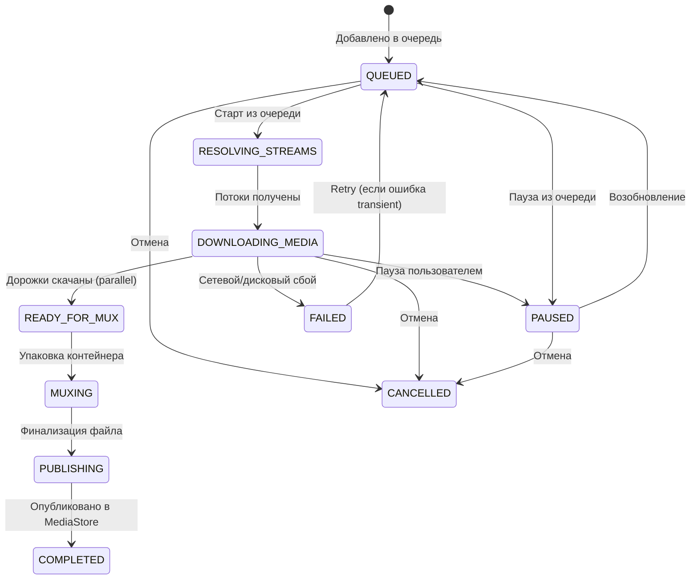

# SmartTube VOX 8 — Downloads 2.0 Queue & Reliability Architecture

## 1. Введение и цели очереди загрузок

В ТВ-окружении (Android TV, ТВ-приставки Dune HD, телевизоры TCL) ресурсы процессора, оперативной памяти и пропускная способность флэш-памяти (eMMC) строго ограничены. Параллельное выполнение нескольких тяжелых загрузок с последующей упаковкой контейнеров MP4/MKV приводит к:
1. Зависаниям интерфейса и деградации воспроизведения медиа.
2. Конкуренции за полосу пропускания сетевого интерфейса и взаимному замедлению.
3. Исчерпанию дескрипторов файлов и памяти на слабых ТВ-платформах.

В **Downloads 2.0 (Patch #11)** внедрена однопоточная очередь с поддержкой FIFO-порядка, паузы/возобновления, интеллектуальных повторов и защиты от падений.

---

## 2. Архитектура очереди (Concurrency Model)

### 2.1. Лимит параллелизма: `MAX_ACTIVE_DOWNLOAD_JOBS = 1`
* В единицу времени активным (`activeJobId`) может быть только **одно** задание скачивания.
* Все последующие запросы на скачивание или возобновление помещаются в потокобезопасную очередь ожидания `pendingQueue = ConcurrentLinkedQueue<String>()` в состоянии `QUEUED`.
* При завершении активного задания (`COMPLETED`, `FAILED`, `CANCELLED` или `PAUSED`) координатор автоматически вызывает `processNextQueuedJob()`, извлекая следующую задачу по принципу **FIFO** (с приоритетом по времени создания `createdAt`).

### 2.2. Жизненный цикл состояний задания (State Machine)

---

## 3. Политика повторов и классификация ошибок (Retry Policy)

При сбое задания скачивания (`FAILED`) повторный запуск (`retryDownload`) анализирует категорию ошибки:

1. **Неустранимые (Permanent) ошибки**:
   * `STORAGE_FULL` / `INSUFFICIENT_STORAGE`: недостаток места на носителе.
   * `UNSUPPORTED_CODEC` / `UNSUPPORTED_FORMAT`: неподдерживаемый кодек.
   * Обычный `retry` **блокируется**, предотвращая бесконечный цикл сбоев. Требуется явный принудительный запуск (`force = true`).
2. **Временные (Transient) ошибки**:
   * `NETWORK`, `TIMEOUT`, `STALL`, `RESOLVE_FAILED`.
   * Разрешены для автоматического или ручного повтора. Сохраняются уже скачанные треки и байты (Range Resumption).

---

## 4. Предварительная проверка свободного места на диске (Storage Pre-check)

Перед началом скачивания потоков `VoxDownloadCoordinator` вычисляет наихудшую оценку требуемого дискового пространства:
$$\text{WorstCaseBytes} = (\text{VideoBytes} + \text{AudioBytes} + \text{TransBytes}) \times 2 + 10\text{ МБ}$$

* Множитель $\times 2$ резервирует место под исходные элементарные дорожки и результирующий контейнер MKV/MP4.
* $+ 10\text{ МБ}$ гарантирует системный запас для журналирования и метаданных.
* Если доступного места недостаточно, задание прерывается на этапе инициализации с типизированным кодом `INSUFFICIENT_STORAGE`, исключая зависание системы при заполнении диска на 100%.

---

## 5. Восстановление после сбоев (Crash Recovery)

При неожиданном завершении процесса приложения (OOM killer Android, отключение питания ТВ):
1. `VoxDownloadRepository` при старте сканирует все сохраненные задания.
2. Любые задания, оставшиеся в активных промежуточных состояниях (`RESOLVING_STREAMS`, `DOWNLOADING_MEDIA`, `MUXING`), переводятся в безопасное состояние `QUEUED` (или `PAUSED`).
3. При возобновлении сохраненные частичные файлы на диске верифицируются и докачиваются через HTTP Range без потери прогресса.

---

## 6. ТВ UI и DPAD-управление

В интерфейсе ТВ (Leanback / DPAD):
* Статус `QUEUED` локализован как **«В очереди»** (англ. *«Queued»*).
* При фокусе на задании в очереди или на активном задании доступны контекстные действия:
  * **Пауза**: приостанавливает скачивание и немедленно запускает следующее задание из очереди.
  * **Возобновить**: возвращает задание в очередь на выполнение.
  * **Повторить**: перезапускает упавшее задание при устранении проблемы (например, подключении сети).
  * **Отмена / Удалить**: удаляет временные файлы и очищает очередь.

---

## 7. Агрегированные метрики и Zero-PII диагностика

В `VoxDownloadCoordinator.getDiagnosticsSummary()` собирается сводная статистика состояния очереди:
* `queue_pending_count`: количество ожидающих заданий.
* `queue_active_id_present`: флаг наличия активного скачивания (без ID видео и без персональных данных).
* `jobs_completed_count`, `jobs_paused_count`, `jobs_failed_count`.
* `total_stall_events`: суммарное число обнаруженных зависаний сокетов.
* `total_range_resumptions`: суммарное число успешных докачек.
* `max_peak_speed_mbps`: максимальная зафиксированная скорость.

Все поля строго соответствуют политике **Zero-PII**: отсутствуют заголовки видео, URL-адреса, токены и идентификаторы пользователей.
