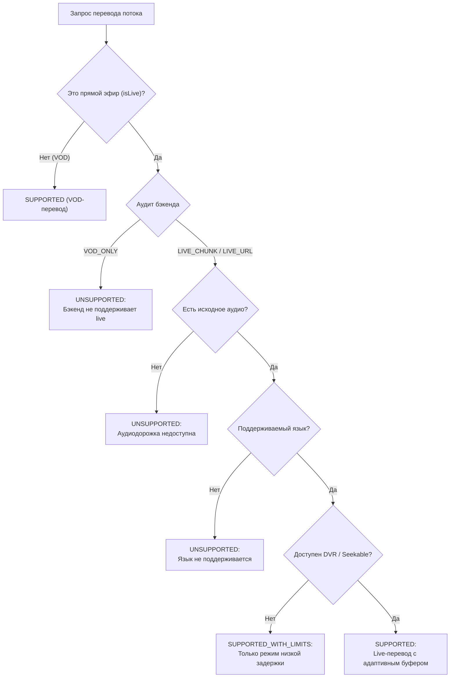

# Архитектура живого перевода (Live Translation) и динамического буфера VOX

В данном документе описывается архитектура подсистемы закадрового перевода прямых трансляций (Live Streams), математическая модель динамического буфера задержки, контроллеры синхронизации, аудит возможностей внешнего бэкенда Яндекса и механизмы безопасного отката (fallback) в SmartTube VOX.

---

## 1. Проблематика перевода прямых трансляций

В отличие от классических VOD-видео (Video on Demand) с фиксированной длительностью, перевод прямых трансляций сопряжён с рядом фундаментальных ограничений:

1. **Отсутствие полной аудиодорожки**: Невозможно предварительно скачать или передать полный аудиофайл ролика.
2. **Задержка нейросетевой обработки (Inference Latency)**: Распознавание речи (ASR), машинный перевод (MT) и синтез речи (TTS) требуют непрерывного времени (обычно от 6 до 15 секунд на фрагмент).
3. **Плавающий Live Edge**: Позиция прямого эфира непрерывно смещается вперёд, а при сетевых задержках или ребуферинге расстояние до края эфира может меняться.
4. **DVR-окно и перемотка**: Трансляции с поддержкой DVR позволяют перемещаться назад во времени, тогда как трансляции без DVR не имеют буфера истории.

Для решения этих задач в поколении **SmartTube VOX 7 (Patch #18)** спроектирован конвейер динамической задержки (Dynamic Delay Buffer) и контроллер синхронизации чанков перевода.

---

## 2. Аудит возможностей внешнего бэкенда (Backend Capability Audit)

Перед реализацией клиентского пайплайна был проведён глубокий аудит протокола и конечных точек API Яндекс VOT (`YandexVotApiClient`, `YandexVotProtobuf`, `YandexVotAudioTransfer`, `VotClient`):

| Конечная точка / Метод | Назначение | Требования к данным | Поддержка Live |
|---|---|---|---|
| `POST /video-translation/translate` | Запрос перевода по URL видео | Требует фиксированный URL и точную длительность видео (`double duration > 0`). Возвращает статус `WAITING` или готовую ссылку на сгенерированный MP3/M4A аудиофайл. | ❌ Нет (`VOD_ONLY`) |
| `POST /video-translation/audio` | Загрузка локально нарезанного аудио | Требует предварительного расчёта `contentLength` и `audioPartsLength` всего набора фрагментов. Не поддерживает потоковую дозагрузку чанков. | ❌ Нет (`VOD_ONLY`) |
| WebSocket / Streaming API | Потоковая передача чанков | В публичном протоколе Яндекс VOT отсутствуют стриминговые сокеты для клиентской нарезки живого аудио. | ❌ Отсутствует |

### Итог аудита бэкенда: `VOD_ONLY`

- **Классификация**: Текущий бэкенд классифицирован как **`VOD_ONLY`**.
- **Принцип честности VOX**: SmartTube VOX не имитирует «фейковый» live-перевод. Архитектура клиентского буфера, моделей и контроллеров полностью реализована и протестирована, а модуль `VoxLiveTranslationEligibility` честно сообщает пользователю статус `UNSUPPORTED` с русскоязычным пояснением:
  > *«Прямой эфир (live) пока не поддерживается сервисом перевода Яндекса»*.

---

## 3. Модель оценки применимости (`VoxLiveTranslationEligibility`)

Модуль проверки применимости принимает решение о возможности запуска перевода на основе трёхзначной логики:
- `SUPPORTED` — поток полностью пригоден для трансляции с задержкой;
- `SUPPORTED_WITH_LIMITS` — запуск возможен, но с ограничениями (например, узкое DVR-окно);
- `UNSUPPORTED` — перевод невозможен (с указанием точной причины).

---

## 4. Политика динамического буфера задержки (`VoxLiveTranslationDelayPolicy`)

Чтобы зритель слышал синхронную русскую озвучку без постоянных пауз, плеер отступает от края прямого эфира (Live Edge) на заданную задержку:

$$\text{PlaybackPosition} = \text{LiveEdgePosition} - \text{TargetDelay}$$

### Режимы задержки:

| Режим (`LiveDelayMode`) | Минимальная задержка | Целевая задержка | Максимальная задержка | Назначение |
|---|---|---|---|---|
| **`LOW_LATENCY`** | 8 секунд | 12 секунд | 25 секунд | Динамичные стримы, чат, спорт (требует быстрого ответа бэкенда). |
| **`AUTO` (По умолчанию)** | 12 секунд | 18 секунд | 35 секунд | Оптимальный баланс между задержкой и стабильностью буфера перевода. |
| **`STABLE`** | 20 секунд | 30 секунд | 60 секунд | Максимальная надёжность при нестабильном интернет-канале. |

### Динамическая адаптация задержки:
- При падении запаса готового перевода ниже критического порога (5 с) задержка автоматически ступенчато увеличивается (`+5 секунд`, но не более `maxDelayMs`).
- При стабильном запасе буфера (> 2.5 × целевой задержки) на протяжении 10 последовательных проверок задержка плавно уменьшается (`-2 секунды`, но не менее `minDelayMs`).

---

## 5. Модель состояния буфера и чанков

### Состояние буфера (`VoxLiveTranslationBufferState`)
Модель в реальном времени рассчитывает ключевые метрики:
- `liveEdgePositionMs` — текущая позиция прямого эфира;
- `playbackPositionMs` — позиция воспроизведения видеоплеера;
- `translatedAudioReadyUntilMs` — временная отметка, до которой уже синтезирован и готов перевод;
- `bufferAheadMs = max(0, translatedAudioReadyUntilMs - playbackPositionMs)` — запас перевода вперёд;
- `currentDelayMs = max(0, liveEdgePositionMs - playbackPositionMs)` — текущее отставание от эфира;
- `queueDepth` — количество ожидающих/обрабатываемых чанков;
- `isRebuffering` — флаг ожидания догрузки аудиодорожки.

### Чанк перевода (`VoxLiveTranslationChunk`)
Каждый фрагмент речи представляет собой изолированную единицу данных:
- `sequenceNumber` — монотонный порядковый номер;
- `startPositionMs` / `endPositionMs` — временные границы фрагмента;
- `status` (`QUEUED`, `DOWNLOADING_AUDIO`, `REQUESTING_TRANSLATION`, `SYNTHESIZING_TTS`, `READY`, `PLAYED`, `FAILED`, `EXPIRED`);
- `audioUri` — ссылка на синтезированный аудиосегмент;
- `retryCount` — счётчик попыток (максимум 3).

---

## 6. Контроллеры синхронизации и жизненного цикла

### `VoxLiveTranslationSyncController`
- **Ограниченное хранение в памяти**: Автоматически удаляет чанки старше 30 секунд позади позиции воспроизведения (`retentionLimitMs = 30_000`), предотвращая утечки памяти на длинных трансляциях.
- **Жёсткий лимит очереди**: Не более 100 активных чанков одновременно.
- **Инвалидация при перемотке (Seek)**: При смещении позиции воспроизведения более чем на 3 секунды сбрасывает неактуальные очереди и инициирует удержание буфера (Hold) до готовности новых сегментов.
- **Плавная подстройка скорости**: Допустима микрокоррекция скорости воспроизведения плеера (0.95x – 1.05x) для устранения фазового расхождения без слышимых искажений высоты тона (pitch).

### `VoxLiveTranslationController`
- Управляет состояниями жизненного цикла (`IDLE`, `BUFFERING_INITIAL_DELAY`, `ACTIVE`, `REBUFFERING`, `FALLBACK_ORIGINAL`, `STOPPED`).
- **Безопасный откат (Fallback)**: При трёхкратной неудаче перевода или таймауте бэкенда плеер мгновенно восстанавливает 100% громкость оригинальной дорожки трансляции без остановки видео и сообщает зрителю причину.

---

## 7. Интеграция с журналом безопасной диагностики (Safe Logging)

Все ключевые события подсистемы живого перевода регистрируются в кольцевом журнале ошибок и отчётах диагностики по стандарту `vox-diagnostic-report-v2`:

| Код события (`VoxLogCode`) | Уровень | Описание события |
|---|---|---|
| `LIVE_TRANSLATION_START` | `INFO` | Запуск конвейера живого перевода с указанием выбранного режима задержки. |
| `LIVE_TRANSLATION_BUFFER_READY` | `INFO` | Первоначальный буфер задержки набран, старт синхронного воспроизведения. |
| `LIVE_TRANSLATION_BUFFER_LOW` | `WARN` | Запас синтезированного перевода упал ниже безопасного порога (5 с). |
| `LIVE_TRANSLATION_DELAY_INCREASED` | `INFO` | Автоматическое увеличение задержки для предотвращения прерываний звука. |
| `LIVE_TRANSLATION_DELAY_DECREASED` | `INFO` | Плавное приближение к прямому эфиру при стабильном конвейере. |
| `LIVE_TRANSLATION_REBUFFER` | `WARN` | Временная приостановка дорожки перевода для накопления чанков. |
| `LIVE_TRANSLATION_BACKEND_TIMEOUT` | `WARN` | Таймаут ответа сервера перевода на чанк. |
| `LIVE_TRANSLATION_FALLBACK_ORIGINAL`| `ERROR`| Автоматический откат на 100% оригинальный звук при невозможности синтеза. |
| `LIVE_TRANSLATION_STOPPED` | `INFO` | Корректная остановка конвейера и освобождение ресурсов. |

---

## 8. Кроссплатформенный статус

| Компонент | Android TV (Kotlin) | Samsung Tizen (JS/Web) | Примечание |
|---|---|---|---|
| Модели eligibility и delay policy | ✅ Реализовано (`com.liskovsoft...vox.translation`) | 📐 Архитектурная модель | 100% покрытие unit-тестами на Android TV. |
| Модель буфера и чанков | ✅ Реализовано | 📐 Архитектурная модель | Bounded queue, автоочистка истории. |
| Контроллер синхронизации | ✅ Реализовано | 📐 Архитектурная модель | Поддержка seek invalidation и fallback. |
| Контракт кодов логирования | ✅ `VoxLogCode.kt` | ✅ `TizenSafeLogger.js` | Полный паритет кодов `LIVE_TRANSLATION_*`. |
| Реальный live-перевод бэкендом | ❌ `VOD_ONLY` | ❌ `VOD_ONLY` | Ожидает появления streaming API со стороны сервиса перевода. |
