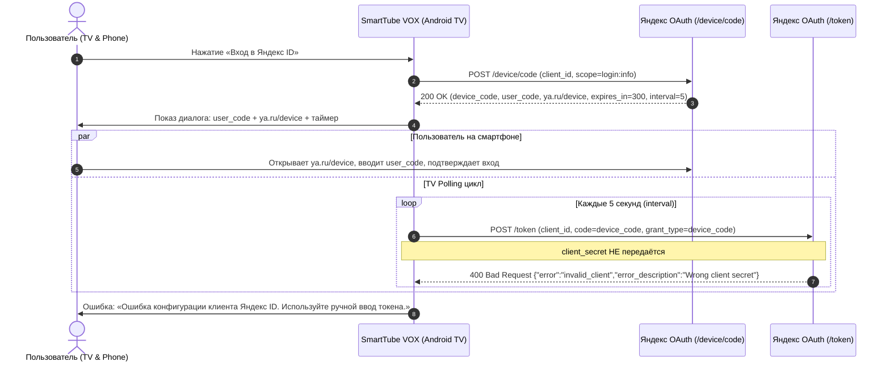

# Исследование и архитектурный план: Авторизация Яндекс ID (Device Code Flow) в SmartTube VOX

> **Статус документа:** Исследовательский отчёт и архитектурный план (Batch #23)<br>
> **Базовый коммит:** `177b6204` (`fix/yandex-auth-diagnostics`)<br>
> **Изменения в коде:** Отсутствуют (Source changes: NONE)<br>
> **Принцип:** Никаких недокументированных допущений; отделение подтверждённых фактов от гипотез.

---

## 1. Текущая реализация в проекте

### 1.1. Задействованные классы и компоненты
В кодовой базе за реализацию и обработку Device Authorization Flow отвечают следующие классы:

1. **`YandexDeviceCodeClient`** (`com.liskovsoft.smartyoutubetv2.common.oauth.YandexDeviceCodeClient`):
   - Чистая реализация HTTP-клиента на `java.net.HttpURLConnection` (без тяжелых зависимостей для тестируемости в JVM unit-тестах).
   - `getDeviceCode(clientId)`: отправляет `POST https://oauth.yandex.com/device/code` с `client_id` и `scope=login:info`.
   - `pollForToken(clientId, deviceCode)`: отправляет `POST https://oauth.yandex.com/token` с телом `client_id=...&code=...&grant_type=device_code`.
   - Парсинг ответов через простой regex-парсер JSON без сторонних библиотек.
2. **`YandexDeviceAuthDialog`** (`com.liskovsoft.smartyoutubetv2.common.oauth.YandexDeviceAuthDialog`):
   - UI-диалог для Android TV на базе `AlertDialog` (`vot_device_auth_dialog.xml`).
   - Отображает `user_code` крупным моноширинным шрифтом, URL `ya.ru/device`, обратный отсчёт времени жизни кода (`expires_in`).
   - Управляет жизненным циклом polling через RxJava `Observable`.
   - Защита от устаревших асинхронных ответов (stale callbacks) через `YandexPollingSession`.
   - Обработка состояний: `PENDING`, `SLOW_DOWN`, `NETWORK_ERROR`, `ACCESS_DENIED`, `EXPIRED`, `INVALID_CLIENT`, `SUCCESS`.
3. **`YandexTokenPollResult`** (`com.liskovsoft.smartyoutubetv2.common.oauth.YandexTokenPollResult`):
   - Модель результата поллинга (`Type.PENDING`, `SLOW_DOWN`, `ACCESS_DENIED`, `EXPIRED`, `INVALID_CLIENT`, `SUCCESS`, `NETWORK_ERROR`).
   - Метод `isTerminal()` определяет завершение цикла опроса.
4. **`YandexDeviceCodeResponse`** (`com.liskovsoft.smartyoutubetv2.common.oauth.YandexDeviceCodeResponse`):
   - Модель ответа шага инициализации (`device_code`, `user_code`, `verification_url`, `expires_in`, `interval`).
5. **`YandexPollingSession`** (`com.liskovsoft.smartyoutubetv2.common.oauth.YandexPollingSession`):
   - Атомарный счётчик активной сессии для предотвращения race condition при закрытии/переоткрытии диалога.
6. **`VotData`** (`com.liskovsoft.smartyoutubetv2.common.prefs.VotData`):
   - Хранилище настроек и токена авторизации (`setOAuthToken()`, `getOAuthToken()`, `hasOAuthToken()`, `getAuthState()`).
   - При успешном получении токена сохраняет его в защищённые настройки, выставляет статус `UNVERIFIED` и активирует режим Lively.
7. **`VotTokenEditDialog`** (`com.liskovsoft.smartyoutubetv2.common.dialogs.VotTokenEditDialog`):
   - Диалог резервного ручного ввода токена с валидацией через `VotOAuthTokenValidator`.

---

### 1.2. Схема текущего процесса (Device Code Flow)



---

### 1.3. Разделение текущего состояния реализации

| Категория | Элементы реализации | Статус и подтверждение |
| :--- | :--- | :--- |
| **Реализовано корректно** | Архитектура диалога TV, верстка, D-pad навигация, таймер обратного отсчёта, монотонный `sessionId` против stale callback-ов, безопасное закрытие без сброса сохранённого токена, валидация формата токена. | Подтверждено локальным кодом и TV-приёмкой в Batch #21. |
| **Подтверждено mock-тестами** | Полный цикл парсинга JSON ответов, обработка всех кодов ошибок (`slow_down`, `authorization_pending`, `access_denied`, `expired_token`, `invalid_client`), логика `YandexPollingSession`. | 203 unit-теста проходят успешно (`YandexDeviceCodeClientTest`, `YandexPollingSessionTest`). |
| **Подтверждено реальным ответом сервера** | 1. Шаг 1 (`/device/code`): успешный возврат `user_code`, `device_code`, `verification_url`.<br>2. Шаг 2 (`/token`): сервер Яндекс возвращает **HTTP 400 `{"error":"invalid_client","error_description":"Wrong client secret"}`**. | Подтверждено реальными сетевыми логами при интеграционном тестировании (коммит `f52e3dc6`). |
| **Остаётся неизвестным** | Возможно ли перевести клиентское приложение в консоли Яндекс OAuth в статус чистого «публичного клиента» (Public Client) для Device Flow без требования `client_secret` (требуется ответ поддержки Яндекса). | Требует официального подтверждения Яндекса. |

---

## 2. Подтверждённая ошибка и первопричина

### 2.1. Точный ответ сервера
При попытке обмена `device_code` на `access_token` эндпоинт `https://oauth.yandex.com/token` отвечает:
```http
HTTP/1.1 400 Bad Request
Content-Type: application/json; charset=utf-8

{
  "error": "invalid_client",
  "error_description": "Wrong client secret"
}
```

### 2.2. Первопричина (Root Cause)
1. Клиент `YandexDeviceCodeClient` отправляет запрос поллинга без параметра `client_secret`:
   ```http
   POST /token HTTP/1.1
   Host: oauth.yandex.com
   Content-Type: application/x-www-form-urlencoded

   client_id=a80318baa39742079143855c77b13709&code=<device_code>&grant_type=device_code
   ```
2. Согласно протоколу OAuth 2.0 (RFC 6749 и RFC 8628), клиенты делятся на:
   - **Confidential Clients** (серверные приложения, способные безопасно хранить секрет);
   - **Public Clients** (мобильные/десктопные/TV клиенты, распространяемые в бинарном виде, где секрет невозможно скрыть от декомпиляции).
3. Приложение с `client_id=a80318baa39742079143855c77b13709` зарегистрировано в Яндекс OAuth как клиент, требующий обязательной аутентификации секретом приложения (`client_secret`), либо Яндекс OAuth в принципе требует `client_secret` для `grant_type=device_code` на уровне своей реализации.

---

## 3. Требования Яндекс OAuth (на основе официальной документации)

*Источники: официальная документация Яндекс ID / Яндекс OAuth (`https://yandex.ru/dev/id/doc/`)*

### 3.1. Device Authorization Flow в Яндекс ID
1. **Эндпоинты:**
   - Запрос кодов: `POST https://oauth.yandex.ru/device/code` (или `oauth.yandex.com`)
   - Обмен на токен: `POST https://oauth.yandex.ru/token` (или `oauth.yandex.com`)
2. **Параметры обмена на токен (`/token`):**
   - Официальная документация Яндекса по получению токена через Device Code явно указывает в списке **обязательных параметров**:
     - `grant_type`: `device_code`
     - `code`: полученный `device_code`
     - `client_id`: идентификатор приложения
     - `client_secret`: секретный ключ приложения
3. **Способы передачи учетных данных клиента:**
   - В теле `POST`-запроса (url-encoded);
   - В заголовке `Authorization: Basic <base64(client_id:client_secret)>`.

### 3.2. Поддержка PKCE (Proof Key for Code Exchange)
1. Яндекс ID поддерживает PKCE (`code_verifier`, `code_challenge`, `code_challenge_method=S256` / `plain`).
2. Официально задокументировано: *«Если при запросе используется расширение PKCE и передается параметр `code_verifier`, передача секретного ключа приложения (`client_secret`) не требуется»*.
3. **Критическое ограничение:** Согласно документации Яндекса, PKCE задокументирован и поддерживается **только для Authorization Code Flow** (раздел *«Получение кода подтверждения из URL»* с `response_type=code`), где пользователь взаимодействует через системный браузер и редирект.
4. В документации по Device Code Flow (`/device/code`) параметры PKCE (`code_challenge` / `code_verifier`) не упоминаются.

### 3.3. Платформы и типы приложений
1. В консоли регистрации (`oauth.yandex.ru/client/new`) тип приложения выбирается один раз и не может быть изменён после создания.
2. Каждому зарегистрированному приложению всегда генерируется `client_secret`.
3. Для чистых мобильных платформ Яндекс предлагает LoginSDK, однако на Android TV использование веб-редиректов и сторонних SDK часто ограничено отсутствием браузера в прошивке.

---

## 4. Сравнительный анализ возможных архитектур

| Параметр | Архитектура A: Существующий Device Flow | Архитектура B: Authorization Code + PKCE | Архитектура C: Безопасный серверный посредник | Архитектура D: Сохранение ручного ввода |
| :--- | :--- | :--- | :--- | :--- |
| **Суть решения** | Прямой поллинг TV → Яндекс без секрета | Авторизация через браузер/QR с PKCE без секрета | Выделенный бэкенд хранит `client_secret` и выполняет поллинг | Пользователь копирует токен с телефона и вводит на TV |
| **Что требуется реализовать** | Ничего нового в коде (уже написано) | Генератор PKCE, QR-код с URL авторизации, приём кода на TV | Легковесный бэкенд-сервис, обновление клиента в приложении | Ничего нового (уже работает в коде) |
| **Передача результата телефон → ТВ** | Автоматически через Яндекс OAuth сервер | Требуется отдельный транспорт (локальный HTTP-сервер на TV или ручной ввод) | Автоматически через посредника по ID сессии | Вручную с пульта или через буфер обмена TV Remote App |
| **Где хранится `client_secret`** | Отсутствует (поэтому 400) | **Не требуется** (PKCE заменяет секрет) | В защищённых переменных окружения сервера | Отсутствует |
| **Необходимые серверные компоненты** | Нет | Опционально (rendezvous-сервер приёма кода) | **Да** (Cloudflare Worker / Node / Go микросервис) | **Нет** |
| **Защита связки телефон ↔ ТВ** | Обеспечивается Яндексом (`ya.ru/device`) | Криптографическая привязка `code_verifier` ↔ `code_challenge` | Одноразовый криптографический `session_id` + короткий TTL | Прямой физический ввод пользователем |
| **Риски повторного использования** | Отсутствуют (одноразовый `device_code`) | Отсутствуют (`code` одноразовый) | Минимальны при одноразовой сессии и zero-retention | Минимальны |
| **Ограничения для пользователя** | **Не работает** из-за ошибки 400 | Необходимость сканирования QR и передачи кода на TV | Требуется доступность стороннего сервера | Требуется набрать/вставить строку символов |
| **Зависимость от решения Яндекса** | **100% зависимость** (нужен public client) | Зависит от возможности передачи кода без web-редиректа на TV | **0% зависимости** (работает по официальной спецификации Яндекса) | **0% зависимости** |

---

## 5. Анализ безопасности каждой архитектуры

### Архитектура A (Device Code без секрета)
- **Уязвимость встраивания секрета:** Если попытаться «починить» вариант A простым добавлением `client_secret` в Android APK, это приведёт к фатальной компрометации. APK легко декомпилируется (через `jadx` / `apktool`), секрет извлекается, и любой злоумышленник получает возможность выпускать токены от имени приложения, что приведёт к блокировке приложения Яндексом. **Встраивание секрета в APK категорически недопустимо.**

### Архитектура B (Authorization Code + PKCE)
- **Безопасность криптографии:** Идеальна с точки зрения OAuth 2.0 (RFC 7636). Секрет не нужен.
- **Слабое место — канал передачи кода с телефона на ТВ:**
  - Если поднимать локальный HTTP-сервер на TV (`http://<tv-ip>:port/callback`): во многих домашних сетях включена изоляция клиентов (Client/AP Isolation), блокирующая связь телефон ↔ ТВ; кроме того, Android TV может усыплять фоновые сокеты.
  - Если передавать через сторонний облачный сервер: возвращаемся к необходимости сторонней инфраструктуры (как в варианте C).

### Архитектура C (Безопасный серверный посредник)
- **Почему простой HTTP-прокси недопустим:**
  - Открытый прокси (`client_secret` подставляется в любой входящий запрос) немедленно превращается в вектор атак (DDoS Яндекса чужими руками, кража квот, бан IP).
- **Требования к безопасному посреднику:**
  1. **Zero-Storage Policy:** Сервер не хранит токены в базе данных или на диске. Токен передаётся в потоке ответа и сразу стирается из памяти.
  2. **Ограничение эндпоинтов:** Посредник разрешает обращение *только* к `https://oauth.yandex.ru/token` с фиксированным `client_id` и `grant_type=device_code`.
  3. **Rate Limiting:** Ограничение частоты запросов по IP для предотвращения злоупотреблений.
  4. **Одноразовый сессионный токен:** Связка TV и сессии обмена валидируется коротким временем жизни (TTL 5 минут).

### Архитектура D (Ручной ввод токена)
- **Безопасность:** Наивысшая из локальных решений.
- Токен передаётся напрямую из браузера пользователя в локальное защищённое хранилище SmartTube VOX (`VotData` / SharedPreferences).
- Никакие третьи серверы не участвуют. Токен не покидает локальное устройство.

---

## 6. Вопросы для обращения в службу поддержки Яндекс OAuth

В проектных материалах ответ поддержки Яндекса по данному `client_id` в настоящее время **отсутствует**.

Для прояснения статуса необходимо направить официальный запрос со следующими вопросами:

1. **Поддержка Public Client для Device Authorization Grant (RFC 8628):**
   > *«Поддерживает ли Яндекс OAuth сценарий Device Authorization Flow (`grant_type=device_code`) для публичных клиентских приложений (Smart TV / Android TV), где `client_secret` технически не может быть сохранён в тайне от декомпиляции? Возможно ли в настройках приложения в консоли OAuth отключить обязательное требование `client_secret` при запросе токена по `device_code`?»*
2. **Альтернативные параметры для Device Flow:**
   > *«Существует ли возможность использовать PKCE (`code_verifier` / `code_challenge`) совместно с эндпоинтом `/device/code` и `grant_type=device_code` взамен `client_secret`?»*
3. **Рекомендуемый тип приложения для Android TV:**
   > *«Какой тип платформы и сценарий авторизации Яндекс рекомендует для устройств Android TV без встроенного системного браузера?»*

---

## 7. План дальнейшей реализации после выбора решения

### Сценарий 1: Если Яндекс подтвердит поддержку Public Client для Device Flow
1. Перенастроить карточку приложения в консоли Яндекс OAuth.
2. Текущий код `YandexDeviceCodeClient` и `YandexDeviceAuthDialog` уже полностью готов — автоматический вход заработает без архитектурных переделок.

### Сценарий 2: Если `client_secret` строго обязателен и публичные клиенты не поддерживаются
1. Разработать спецификацию и архитектуру легковесного защищённого релея (Cloudflare Worker с zero-storage).
2. Провести аудит безопасности релея.
3. Согласовать развёртывание инфраструктуры.
4. Обновить `YandexDeviceCodeClient` для обращения к эндпоинту релея вместо прямого вызова `oauth.yandex.com/token`.

### Сценарий 3: До принятия решения по внешнему серверу
1. Сохранить текущий статус: автоматический диалог показывает понятную ошибку конфигурации со ссылкой на ручной ввод.
2. Основным и стабильным способом входа остаётся **ручной ввод токена** (`VotTokenEditDialog`).

---

## 8. Правила неприкосновенности рабочего приложения

При любых последующих работах над авторизацией строго запрещается изменять или нарушать следующие проверенные компоненты:

1. **Оригинальный интерфейс SmartTube:** Базовые стили, сетки, темы Leanback, контролы плеера и порядок навигации D-pad должны оставаться неизменными.
2. **VOT Standard:** Базовый перевод без авторизации должен всегда оставаться полностью работоспособным.
3. **VOT Lively:** Логика работы режима «Живой голос» при наличии валидного токена в `VotData` не должна модифицироваться.
4. **Кнопка перевода («文A»):** Расположение, порядок в HUD и логика переключения между состояниями защищены.
5. **Синхронизация аудиодорожек:** Механизмы `TranslationAudioPlayer` (пауза, возобновление, перемотка, скорость, ducking) трогать запрещено.
6. **Сохранённые токены пользователей:** Операции обновления кода или отмены авторизации ни при каких обстоятельствах не должны вызывать сброс (`clearOAuthToken()`).
7. **Флейвор `ststable`:** Не должен содержать зависимостей или артефактов VOT.
