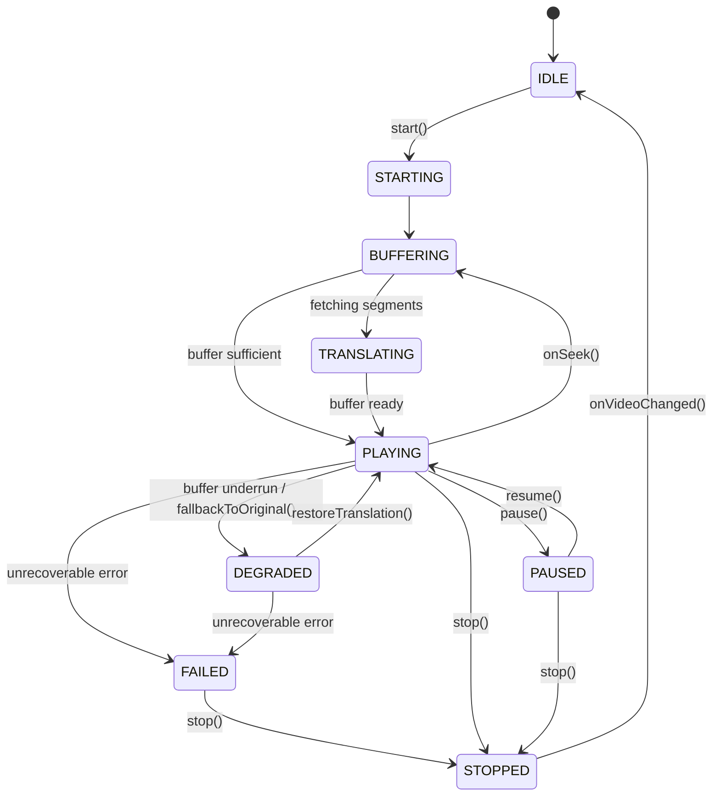

# SmartTube VOX 8 — Архитектура Translation 2.0

## Введение
Данный документ описывает фундаментальную архитектуру подсистемы перевода **Translation 2.0** в SmartTube VOX 8. Архитектура объединяет существующий стабильный механизм перевода готовых видео (VOD) и закладывает основу для будущего перевода прямых трансляций (Live Translation).

---

## 1. Текущий VOD Pipeline

### 1.1. Компоненты VOD в кодовой базе
- **`VoiceTranslateController.java`**: Основной контроллер уровня плеера. Управляет жизненным циклом перевода, кнопками UI, автопереводом, задержкой звука (`ducking`) и синхронизацией дорожек.
- **`YandexVotOrchestrator.java`**: Координатор бизнес-логики запросов к сервису перевода Яндекс VOT, пула повторов, опроса статуса (polling) и проверки поколения видео.
- **`YandexVotPlaybackAdapter.java`**: Адаптер, связывающий состояние перевода со вторичным экземпляром ExoPlayer (`TranslationAudioPlayer.java`).
- **`YandexVotApiClient.java` & `YandexVotProtobuf.java`**: Сетевой клиент Protobuf через HTTPS к конечной точке `https://api.browser.yandex.ru/video-translation/translate`.
- **`TranslationAudioPlayer.java`**: Выделенный аудиоплеер ExoPlayer для проигрывания переведённого MP3 потока параллельно основному видеоряду.

### 1.2. Последовательность обработки VOD (Actual Flow)
```
Видео (YouTube VOD)
  │
  ├─► Извлечение метаданных: videoId, duration, sourceLanguage, targetLanguage (ru)
  │
  ├─► Проверка авторизации Яндекс ID (если настроена) и генерация заголовков HMAC/Token
  │
  ├─► Protobuf-запрос: YandexVotApiClient.translateVideo(url, duration)
  │
  ├─► Polling статуса: WAITING (ожидание генерации нейросетью) ──► READY (mp3 audio_file_url)
  │
  ├─► Подготовка вторичного ExoPlayer: загрузка audio_file_url, предбуферизация
  │
  ├─► Аудио-дакинг (ducking): приглушение оригинальной дорожки до 10-25%
  │
  └─► Синхронный старт и сопровождение: периодическая коррекция дрейфа при паузе/перемотке
```

---

## 2. Текущие ограничения бэкенда Яндекс VOT

1. **Монолитный характер перевода**: Публичный Protobuf API Яндекса принимает на вход полный URL ролика и фиксированную длительность всего видео.
2. **Результат в виде единого файла**: Сервер возвращает ссылку на цельный аудиофайл (`.mp3`), содержащий озвучку всего ролика целиком.
3. **Отсутствие API для потоковых чанков**: В текущем публичном REST/Protobuf контракте отсутствует эндпоинт для инкрементальной передачи аудиофрагментов (HLS/DASH сегментов).
4. **Необходимость стабильного media URL**: Серверная часть Яндекса самостоятельно выкачивает аудиодорожку по переданной ссылке; динамические live-потоки без DVR не могут быть обработаны бэкендом как статичный файл.
5. **Rate Limiting**: При частых повторных запросах сервер возвращает код `429 Too Many Requests` или блокирует сессию по IP/токену.

---

## 3. Почему Live сейчас не работает (Статус: VOD_ONLY)

- **Честная фиксация статуса**: `LIVE_TRANSLATION_BACKEND = VOD_ONLY`.
- **Запрет Fake Live**: Скачивание 30-секундного куска live-трансляции и подача его в VOD API приводит к ошибке парсинга длительности на сервере или возврату отказа. Это создаёт постоянные зависания, буферизацию и рассинхрон.
- **Инженерный принцип VOX**: Мы не маркируем неподдерживаемую возможность как готовую (`NO FAKE PASS`). Доступность Live Translation в UI будет активирована только тогда, когда появится реальный потоковый протокол.

---

## 4. Proposed Live Pipeline (Архитектура Translation 2.0)

Концептуальная цепочка обработки потокового перевода:
```
┌─────────────┐     ┌──────────────────┐     ┌──────────────────────┐
│ LiveSource  │ ──► │ SegmentCollector │ ──► │ VoxTranslationQueue  │
└─────────────┘     └──────────────────┘     └──────────────────────┘
                                                        │
                                                        ▼
┌─────────────┐     ┌──────────────────┐     ┌──────────────────────┐
│ ExoPlayer   │ ◄── │  SyncEngine      │ ◄── │ TranslatedBuffer     │
│ (Dual Track)│     └──────────────────┘     └──────────────────────┘
```

1. **LiveSource**: Источник живого аудио (YouTube Live DASH/HLS audio stream).
2. **SegmentCollector**: Нарезка входящего звукового потока на калиброванные сегменты фиксированной длительности (например, 4–8 сек).
3. **TranslationQueue**: Ограниченная очередь запросов с дедупликацией и управлением приоритетами.
4. **TranslatedBuffer**: Буфер готовых аудио-сегментов перевода с отслеживанием горизонта опережения.
5. **SyncEngine**: Контроллер сведения дорожек с адаптацией под скорость и коррекцией дрейфа.
6. **Player**: Воспроизведение звука с автоматическим fallback на оригинал при просадке буфера.

---

## 5. Session Model (`VoxTranslationSession`)

Жизненный цикл сессии перевода изолирован от UI и плеера через конечный автомат:



### Режимы работы (`VoxTranslationMode`):
- **`AUTO`** (Авто): Адаптивная задержка (15-20 сек), баланс между задержкой эфира и стабильностью.
- **`LOW_LATENCY`** (Минимальная задержка): Минимальный буфер (8-12 сек), высокий риск просадок при колебаниях сети.
- **`STABLE`** (Стабильный перевод): Увеличенный буфер (25-35 сек), максимальная защита от опустошения буфера.

---

## 6. Segment Queue (`VoxTranslationQueue`)

Очередь сегментов разработана с учётом строгих требований к надежности:
- **Ограниченная ёмкость (`maxCapacity = 50`)**: Защита от утечек оперативной памяти на ТВ-приставках с объемом ОЗУ 1-2 ГБ.
- **Строгое сохранение порядка (`sequence`)**: Сегменты сортируются по их временным меткам через `ConcurrentSkipListMap`.
- **Дедупликация**: Повторные запросы одного и того же интервала отсекаются по `segmentId` и `sequence`.
- **Инвалидация при перемотке**: Сегменты старых поколений (`generationId`) мгновенно переводятся в статус `DISCARDED`.
- **Очистка отмененных задач**: При остановке вызывается `cancelAll()`, исключающий появление фоновых задач-«сирот» (orphan jobs).

---

## 7. Buffer Model (`VoxTranslatedBuffer`)

Буфер хранит готовые сегменты и рассчитывает непрерывный горизонт воспроизведения:
- **`bufferedAheadMs`**: Непрерывный запас звука от текущей точки воспроизведения.
- **`minimumPlayableBufferMs`**: Базовый порог (обычно 4 000 мс).
- **`targetBufferMs`**: Целевой запас буфера (18 000 мс для Auto).
- **`isBufferCritical`**: Флаг опасного истощения (< 50% от минимального порога), сигнализирующий о необходимости временного перехода на оригинал.

---

## 8. Sync Engine (`VoxTranslationSyncEngine`)

Контроллер синхронизации вычисляет величину дрейфа `driftMs = translatedPositionMs - sourcePositionMs`:

| Величина дрейфа | Действие (`VoxSyncAction`) | Поведение системы |
|---|---|---|
| `<= 50 мс` | `PLAY` | Идеальная синхронизация, изменений не требуется |
| `51..250 мс` | `RATE_CORRECTION` | Плавная регулировка темпа (коэффициент 0.96x или 1.04x) без скачков звука |
| `> 250 мс` | `SEEK_TRANSLATED` | Принудительное позиционирование вторичного плеера на позицию источника |
| Несоответствие `generationId` | `FALLBACK_ORIGINAL` | Старый звук не воспроизводится, мгновенный возврат к оригинальной дорожке |
| Истощение буфера | `FALLBACK_ORIGINAL` | Защита от заиканий и пауз в основном видеоряде |

---

## 9. Масштабирование буфера при изменении скорости (`Playback Speed`)

При ускоренном воспроизведении расход аудиоматериала увеличивается пропорционально скорости.
Архитектура Translation 2.0 применяет формулу динамического масштабирования минимального буфера:

$$\text{effectiveMinimumBufferMs} = \text{minimumPlayableBufferMs} \times \max(1.0, \text{playbackSpeed})$$

- При скорости **1.0x**: минимальный буфер = **4 000 мс**
- При скорости **1.25x**: минимальный буфер = **5 000 мс**
- При скорости **1.5x**: минимальный буфер = **6 000 мс**
- При скорости **1.75x**: минимальный буфер = **7 000 мс**
- При скорости **2.0x**: минимальный буфер = **8 000 мс**

Это гарантирует, что на скорости 2.0x плеер не столкнётся с внезапным буферизационным голоданием через 2 секунды после старта.

---

## 10. Защита при перемотке (Seek Generation Protection)

Перемотка видео пользователем влечет за собой следующие атомарные шаги:
1. Инкремент маркера поколения: `generationId++`.
2. Инвалидация очереди: все ожидающие сегменты получают статус `DISCARDED`.
3. Очистка буфера: `buffer.clear()`.
4. Защита синхронизатора: любые запаздывающие сетевые ответы со старым `generationId` отбрасываются до попадания в декодер.
5. Звук старого фрагмента физически не может прозвучать на новой временной отметке.

---

## 11. Смена видео (Video Change Cancellation)

При переходе на следующее видео в плейлисте:
- Текущая сессия останавливается (`stop()`);
- Сбрасываются все слушатели и фоновые корутины;
- Буфер и очередь полностью очищаются;
- Поколение повышается, состояние переходит в `IDLE`;
- Исключена ситуация, при которой перевод предыдущего видео накладывается на новое видео.

---

## 12. Fallback Model (Бесшовный откат на оригинал)

При возникновении проблем с переводом:
- Видеопоток **не прерывается** и не ставится на бесконечную паузу;
- Громкость оригинальной дорожки плавно возвращается со сниженного уровня (ducking 15%) до 100%;
- Сессия переходит в состояние `DEGRADED`;
- Пользователю выводится информационный бейдж с понятной причиной на русском языке;
- Когда сетевой буфер восстанавливается, сессия вызывает `restoreTranslation()`, плавно возвращая перевод.

---

## 13. Типизированная модель ошибок и политика повторов

### 13.1. Типы ошибок (`VoxTranslationErrorType`):
1. `NETWORK`: Обрыв сетевого соединения (retryable).
2. `AUTH`: Ошибка авторизации Яндекс ID (non-retryable).
3. `BACKEND_UNAVAILABLE`: Временная недоступность сервиса (retryable).
4. `RATE_LIMITED`: Лимит запросов 429 (retryable с увеличенным backoff).
5. `UNSUPPORTED`: Формат или live-поток не поддерживается сервером (non-retryable).
6. `TIMEOUT`: Таймаут ожидания ответа (retryable).
7. `INVALID_RESPONSE`: Поврежденный ответ (non-retryable).
8. `SEGMENT_FAILED`: Сбой обработки сегмента (retryable).
9. `BUFFER_UNDERRUN`: Критическое истощение буфера (retryable).
10. `CANCELLED`: Запрос отменен пользователем или сменой видео (non-retryable).
11. `UNKNOWN`: Неизвестная ошибка (non-retryable).

### 13.2. Bounded Retry Policy:
- Ограничение числа повторов: `maxRetries = 3`.
- Экспоненциальный откат: $\text{backoff} = \min(\text{baseMs} \times 2^{\text{attempt}} + \text{jitter}, \text{maxBackoffMs})$.
- Строгий запрет на повторы ошибок `AUTH`, `UNSUPPORTED` и `CANCELLED`.

---

## 14. Приватность и Zero-Telemetry

В архитектуре Translation 2.0 соблюдаются фундаментальные требования конфиденциальности:
- **Никаких секретов в логах**: Токены авторизации Яндекс ID, сессионные куки и заголовки `Authorization` никогда не пишутся в системный лог.
- **Никаких URL в отчетах**: Временные подписанные ссылки (`signed media URLs`) и полные адреса потоков не сохраняются дольше срока их жизни и не попадают в диагностические выгрузки.
- **Никаких названий видео**: Диагностические события оперируют только обезличенными техническими идентификаторами категорий.
- **Только явное согласие**: Диагностические данные формируются исключительно по явному действию пользователя в меню настроек.

---

## 15. Безопасные поля диагностики

Для интеграции в систему диагностики `VoxDiagnosticReport` определен срез из 8 безопасных метрик:
1. `mode`: Режим задержки (`auto`, `low_latency`, `stable`).
2. `backendCapability`: Фактическая возможность бэкенда (`VOD_ONLY` / `LIVE_SEGMENTS`).
3. `sessionState`: Текущее состояние конечного автомата сессии (`IDLE`, `PLAYING` и т.д.).
4. `queueDepth`: Текущее количество сегментов в очереди.
5. `bufferedMs`: Непрерывный запас переведенного звука (мс).
6. `averageLatencyMs`: Среднее время ответа бэкенда на сегмент (мс).
7. `lastErrorCategory`: Идентификатор последней ошибки (без сырого текста исключений).
8. `fallbackActive`: Флаг активности обходного воспроизведения оригинального звука (`true`/`false`).

---

## 16. План на Patch #3

На основе подтвержденного статуса **`LIVE_TRANSLATION_BACKEND: VOD_ONLY`**, план следующего шага строится строго на фактах:
1. **Сетевое исследование протоколов (Protocol & Capture Investigation)**:
   - Исследование внутренних механизмов мобильного и десктопного Яндекс Браузера при работе с трансляциями.
   - Проверка наличия WebSocket или gRPC каналов для передачи потокового аудио в реальном времени.
2. **Оценка серверных возможностей**:
   - Если стриминговый API обнаружен: проектирование защищенного сетевого транспорта и прототипа Segment Push.
   - Если стриминговый API закрыт или отсутствует: фиксация архитектурного решения по локальному захвату чанков и согласованию форматов без создания фиктивной поддержки.
3. **Сохранение абсолютной стабильности VOD**: Любые сетевые эксперименты изолируются в отдельных модулях без вмешательства в рабочий контур `YandexVotOrchestrator`.

---

## 17. Protocol Investigation Result (Patch #3)

В ходе реализации Patch #3 проведены фактические сетевые замеры и аудит контрактов:
1. **Сетевой транспорт**:
   - `WebSocket`: **НЕ обнаружен** (отсутствует в клиенте и сервере).
   - `gRPC`: **НЕ обнаружен** (отсутствует в стеке).
   - `HTTP Chunked Streaming`: **НЕ поддерживается** серверными эндпоинтами перевода.
   - Текущий рабочий протокол: `HTTP_POLLING` поверх Protobuf REST API.
2. **Серверные ограничения (Blocker)**:
   - `LIVE_BACKEND_CAPABILITY`: `VOD_ONLY`.
   - `LIVE_TRANSLATION_BLOCKER`: `BACKEND_REQUIRES_COMPLETE_MEDIA`.
   - Сервер отклоняет динамические потоки без финальной длительности (`duration`) и требует завершённый медиафайл.
3. **Безопасность и Feature Flag**:
   - Добавлена модель `VoxLiveProtocolCapability` и `VoxLiveBackendTransport`.
   - Экспериментальный флаг `VOX_LIVE_TRANSLATION_EXPERIMENTAL` по умолчанию строго выключен (`false`).
   - Реализована Zero-Telemetry сетевая инструментация `VoxLiveProtocolLogger` с маскированием секретов и URL.
4. **Следующий шаг (Patch #4)**:
   - В связи с блокировкой `BACKEND_REQUIRES_COMPLETE_MEDIA` прямой клиент-серверный live-перевод через публичный VOT невозможен.
   - Patch #4 сфокусируется на архитектуре прокси-шлюза (Controlled Live Proxy / Ingestion Service) и локального захвата аудиодорожки без сторонних бинарных утилит (без yt-dlp/FFmpeg).
