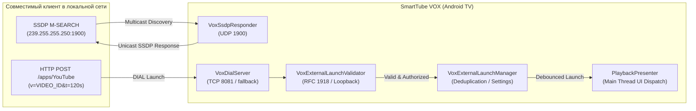

# VOX 5 — Архитектура внешнего запуска видео и DIAL Receiver (Kotlin-First)

Состояние: **Реализовано (Patch #3)**. База: `711893fa1f0dc5d789d0a817d464b132deb63486` (Patch #2 merged). Проверено 30.09.2026.

## Назначение

Подсистема внешнего запуска видео позволяет отправлять YouTube-видеоролики с совместимых устройств в локальной сети (клиенты с поддержкой DIAL, браузерные расширения, скрипты автоматизации) напрямую на Android TV / Google TV в SmartTube VOX по протоколу **DIAL (Discovery and Launch)**.

Реализация выполнена по стандарту **Kotlin-First** в изолированном пакете `com.liskovsoft.smartyoutubetv2.common.vox.external`, не затрагивая существующий стабильный Java-код плеера и изолирована исключительно для флавора `stvot`.

---

## Пользовательский сценарий

1. Пользователь включает настройку в SmartTube VOX: **«Настройки» -> «Пульт» -> «Прочее» -> «Внешний запуск видео»**.
2. Приложение поднимает легковесный HTTP-сервер на порту `8081` (или свободном порту) и регистрирует SSDP-ответчик на `239.255.255.250:1900`.
3. Совместимый клиент в той же локальной сети выполняет поиск по SSDP M-SEARCH (`urn:dial-multiscreen-org:service:dial:1`) или обращается по известному IP:
   - Запрашивает `/dd.xml` (UPnP Device Description).
   - Проверяет статус `/apps/YouTube`.
   - Отправляет команду воспроизведения `POST /apps/YouTube` с параметрами `v=VIDEO_ID&t=TIME`.
4. SmartTube VOX в основном потоке открывает запрошенное видео через штатный `PlaybackPresenter.openVideo(...)`.
5. Если в SmartTube включен автоперевод VOX, он применяется по стандартным правилам пользователя; если выключен — видео воспроизводится в оригинале.

---

## Архитектура

---

## DIAL HTTP

Сервер `VoxDialServer` реализует спецификацию DIAL REST Service:

- **`GET /dd.xml` / `GET /device-desc.xml`**:
  Возвращает экранированное XML описание устройства UPnP 1.0 с заголовком `Application-URL: http://<ip>:<port>/apps/`.
- **`GET /apps/YouTube`**:
  Возвращает текущее состояние приложения: `<state>running</state>` или `<state>stopped</state>`.
- **`POST /apps/YouTube`**:
  Запуск воспроизведения видео. Поддерживает параметры в `application/x-www-form-urlencoded` body или в Query String (`?v=...&t=...`). При успехе возвращает `HTTP/1.1 201 Created` с заголовком `Location: http://<ip>:<port>/apps/YouTube/run`.
- **`DELETE /apps/YouTube/run`**:
  Остановка текущего воспроизведения без закрытия приложения (`PlaybackPresenter.forceFinish()`). Возвращает `HTTP/1.1 200 OK`.
- **`OPTIONS *`**:
  CORS preflight поддержка (`Access-Control-Allow-Origin: *`, `Access-Control-Allow-Methods: GET, POST, DELETE, OPTIONS`, `Access-Control-Allow-Headers: Content-Type`).

---

## SSDP

- Мультикаст-слушатель `VoxSsdpResponder` на `239.255.255.250:1900` на базе изолированного протокольного модуля `VoxSsdpProtocol`.
- Фильтрует поисковые запросы по критериям `urn:dial-multiscreen-org:service:dial:1`, `ssdp:all`, `upnp:rootdevice`.
- Отправляет Unicast UDP ответ `HTTP/1.1 200 OK` с точным `LOCATION: http://<local_ip>:<port>/dd.xml` и `USN: uuid:<device_uuid>::urn:dial-multiscreen-org:service:dial:1`.

---

## Безопасность

1. **Ограничение сетевого доступа (RFC 1918 / Loopback):**
   Разрешены только подключения из приватных диапазонов:
   - `10.0.0.0/8`, `172.16.0.0/12`, `192.168.0.0/16`
   - Link-Local (`169.254.0.0/16`, `fe80::/10`)
   - Loopback (`127.0.0.0/8`, `::1`, `::ffff:127.0.0.1`)
   Запросы с публичных WAN IP немедленно отклоняются с кодом `403 Forbidden`.
2. **Строгая валидация входящих параметров:**
   - Произвольные внешние HTTP/HTTPS ссылки, `file://`, `javascript:`, `intent:`, `content://` и спецсимволы строго отклоняются.
   - Канонические URL YouTube (`youtu.be/...`, `youtube.com/watch?v=...`) нормализуются до проверенного 11-значного идентификатора `videoId` (`^[a-zA-Z0-9_-]{11}$`).
3. **Защита от переполнения буфера (DoS):**
   - Максимальный размер HTTP-заголовков: `8192 байт` (8 КБ) с обязательной проверкой терминатора `\r\n\r\n`.
   - Максимальный размер HTTP-тела: `65536 байт` (64 КБ); при превышении возвращается `413 Payload Too Large`.
   - Невалидный, отрицательный или усеченный `Content-Length` приводит к отказу в обработке (`400 Bad Request`).
   - Сокет-таймаут: `5000 мс`.
4. **Защита от повторных запросов (Deduplication):**
   Повторные запросы на запуск того же видео в пределах 3-секундного окна игнорируются для предотвращения циклических перезагрузок плеера.
5. **Изоляция отладочного ресивера:**
   Диагностический ресивер `YandexVotTestReceiver` объявлен с `android:exported="false"` в debug-манифесте и полностью отсутствует в релизных сборках. Отладочные команды передаются через безопасный внутренний форвардинг в `SplashActivity`.

---

## Настройка

- **Расположение:** Меню SmartTube VOX -> «Настройки» -> «Пульт» -> «Прочее» -> **«Внешний запуск видео»**.
- **Описание в UI:** *«Разрешить устройствам в локальной сети запускать видео в SmartTube VOX»*.
- **Значение по умолчанию:** Выключено (`OFF`).
- **Изоляция:** Отображается только в `stvot` флаворе (`io.github.kiryuhak.smarttubevot.stable`), скрыта в стандартной сборке `ststable`.
- **Поведение:** При отключении настройки серверный сокет и мультикаст-слушатель полностью освобождаются, сетевой порт закрывается.

---

## Ограничения эмулятора

В среде изолированного Android-эмулятора (`Vox-TV-14` / QEMU virtual network `10.0.2.15` за NAT):
- HTTP-эндпоинты (`/dd.xml`, `/apps/YouTube`, `POST launch`) полностью валидированы через ADB port-forwarding (`adb forward tcp:8081 tcp:8081`).
- Мультикаст UDP пакеты SSDP на `239.255.255.250:1900` не могут маршрутизироваться между хостом и виртуальной гостевой подсетью QEMU без специального сетевого моста.
- Текущий статус SSDP на эмуляторе: **`SSDP_EMULATOR_PARTIAL`** (пакетная валидация, маршрутизация ST и генерация ответов подтверждены юнит-тестами на коде `VoxSsdpProtocol`).

---

## Что требует физического телевизора

- **Сквозное автоматическое обнаружение в реальной домашней сети (Real Device Discovery):** `NOT_TESTED`.
  Финальная проверка автоматического обнаружения SmartTube VOX клиентами в домашней Wi-Fi сети будет проведена на этапе физической приемки на реальном телевизоре.
