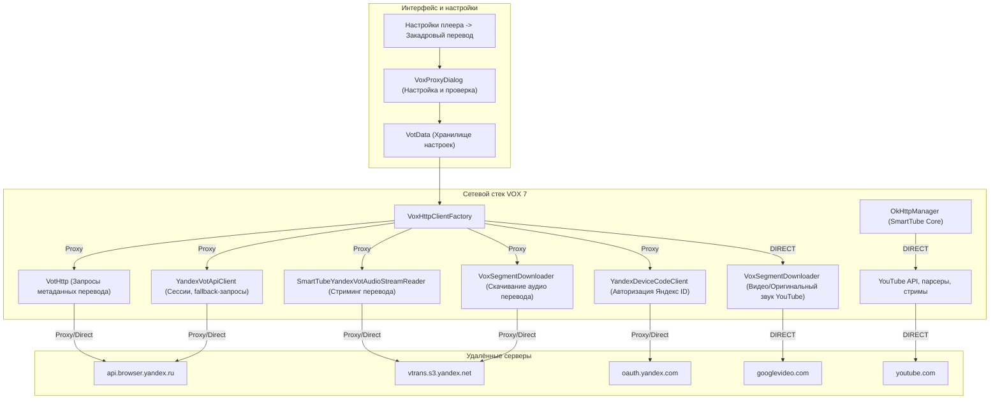

# Изолированный прокси для VOX (SmartTube VOX 7)

## Цель

Предоставить пользователю возможность направлять сетевой трафик закадрового перевода VOX (запросы к бэкенду Яндекс VOT и получение синтезированной аудиодорожки) через пользовательский прокси-сервер, сохраняя прямое (DIRECT) подключение для всего остального трафика SmartTube и YouTube.

## Проблема

В ряде регионов и у некоторых интернет-провайдеров сервисы YouTube работают напрямую без ограничений, однако доступ к эндпоинтам перевода Яндекса (`api.browser.yandex.ru`, `vtrans.s3.yandex.net`, `oauth.yandex.com`) может блокироваться или быть нестабильным.
Использование общесистемного VPN или глобального прокси для всего приложения нерационально: видеопотоки YouTube 4K/60fps требуют высокой пропускной способности, а сторонние VPN создают лишнюю нагрузку и задержки.

Решение: селективная маршрутизация через прокси **только** для сетевых вызовов модуля перевода VOX.

## Архитектура

Архитектура построена на принципе строгой изоляции клиентов без изменения глобального состояния JVM:
1. `VoxProxyConfig`: Неизменяемая (immutable) модель настроек прокси (тип `DIRECT`, `HTTP`, `SOCKS`, хост, порт, опциональные учетные данные). Модель выполняет валидацию хоста и порта без DNS-резолвинга на этапе сохранения.
2. `VoxHttpClientFactory`: Централизованная фабрика изолированных клиентов OkHttp и соединений `HttpURLConnection`. При включённом прокси создает экземпляры клиентов с локально назначенным `java.net.Proxy` и per-client `ProxyAuthenticator`.
3. `VotData`: Сохраняет настройки прокси в изолированном пространстве настроек VOX (`vot_data`).
4. `VoxProxyDialog`: Интерфейс настройки и безопасной проверки доступности (Health Check) без запуска перевода.

## Какие запросы идут через прокси

Когда в настройках включён «Прокси для VOX»:
- Запросы создания сессии и генерации токенов в `api.browser.yandex.ru`.
- Запросы на перевод видео (`/video-translation/translate`).
- Загрузка аудиофрагментов на распознавание (`/video-translation/audio`).
- Потоковое чтение переведенного аудио (`vtrans.s3.yandex.net` / `vtrans.yandex.net`).
- Скачивание дорожки перевода в менеджере загрузок VOX.
- Запросы Device Authorization Flow к `oauth.yandex.com`.

## Какие запросы идут напрямую

Весь остальной трафик SmartTube **всегда** идёт напрямую:
- Метаданные YouTube и работа парсеров (`youtube.com`, `innertube`).
- Видеопотоки и аудиопотоки оригинального контента (`googlevideo.com`).
- Скачивание видеодорожек и оригинальных аудиодорожек в менеджере загрузок.
- Запросы поиска, рекомендаций, истории просмотров.
- DIAL / SSDP в локальной сети.
- Проверка обновлений приложения.

## HTTP

- Поддерживаются стандартные HTTP/HTTPS CONNECT прокси.
- Аутентификация: опциональный Basic Auth через изолированный `okhttp3.Authenticator` и заголовок `Proxy-Authorization`.

## SOCKS5

- Поддерживаются SOCKS4/SOCKS5 прокси через `java.net.Proxy.Type.SOCKS`.

## Безопасность

- **TLS-валидация**: Строго сохраняется стандартная проверка цепочки сертификатов X.509 и сверка имен хостов (нет `trustAllCerts` или отключения `hostnameVerifier`).
- **Скрытие учетных данных**: Логин и пароль прокси никогда не выводятся в лог, исключены из `toString()` и не передаются в сторонние компоненты.
- **Изоляция глобального состояния**: Не модифицируются системные свойства (`System.setProperty("http.proxyHost")`), `ProxySelector.setDefault()` и глобальный `java.net.Authenticator.setDefault()`.
- **Без встроенных публичных прокси**: В приложении отсутствуют хардкод-серверы, списки бесплатных прокси или скрытые VPN-сервисы. Пользователь указывает собственный сервер.

## Ошибки

- При недоступности прокси возвращается понятная ошибка сети (`CONNECT_TIMEOUT`, `UnknownHostException` и т.д.) без аварийного завершения приложения.
- Политика отказа (Fail-closed): При включённом прокси тихий переход на прямое соединение запрещён (respect user privacy/routing intent).

## Ограничения

- Прокси применяется только к сетевым вызовам VOX; если провайдер блокирует YouTube, пользователь настраивает глобальный VPN/прокси независимо.
- Аутентификация для SOCKS5 с логином/паролем в стандартном сетевом стеке Java требует расширенной обработки и документирована как базовая поддержка без передачи паролей в открытом виде.

## Проверки

- `VoxProxyConfigTest`: Проверка корректности валидации портов (1..65535), хостов, фабричных методов и скрытия учетных данных.
- `VoxHttpClientFactoryTest`: Проверка строгой изоляции — клиенты VOX получают сконфигурированный прокси, клиенты YouTube и общие загрузчики остаются на `DIRECT`.
